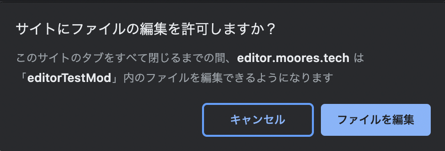
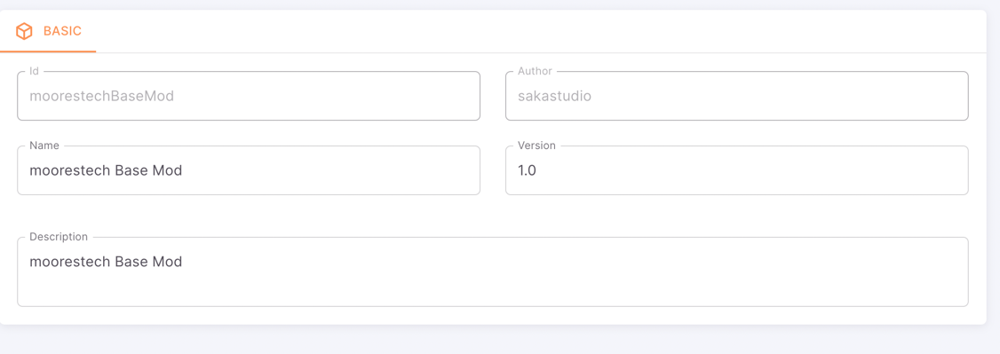
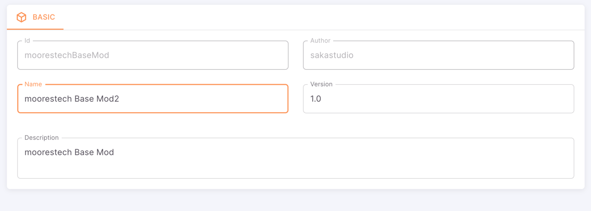
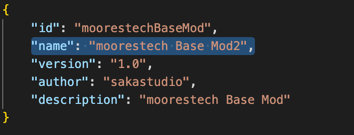
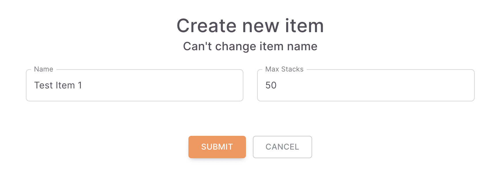

# Getting Started
このチュートリアルでは、既存のmodを取り込み、編集、テストプレイまでを行います。

## 既存modの取り込み
アルファ版時点でのmodはmoorestechBaseModだけとなっています。  
これは実行ファイルの配下にあります。

### 現在のmodファイルを確認する
Steamのmoorestechを右クリック > プロパティ > ローカルファイル > 参照をクリック
modフォルダの中にmoorestechBaseMod.zipがあることが確認できます。

### ファイルを取り込む
zipファイルを解凍し、デスクトップなど好きな場所に移動させてください。  
[エディタ](https://editor.moores.tech/)を開き、上部のOpenProjectで先程解凍したフォルダを選択してください。
  
「サイトにファイルの編集を許可しますか？」というダイアログが出たら、「ファイルを編集」をクリックしてください。

  
  
このように下のフィールドが埋まったらロード成功です。  

## modの編集

### メタデータの編集
modを正常にロードできると、modのID、作成者、名前、バージョンなどのメタデータが表示され、編集できます。
試しに、名前を「moorestech Base Mod 2」に変更してみましょう。

### 編集結果の確認
エディタ上での編集は即座にmodに反映されます。  
先ほど解凍したフォルダを開き、`modMeta.json`を開いてください。  
nameの項目が変更されていることが確認できます。

:::danger id,authorの変更について

modやセーブファイルのロードに問題が生じるため、id,authorの変更はしないでください。

:::

## アイテムの追加
左のサイドバーからItemを選択し、アイテム編集、追加画面に移動します。

### アイテムを編集する
現在名前は編集できません。
最大スタック数、アイテム画像を編集できます。
アイテムの画像はアイコンをクリックすることで編集できます。
試しに、最大スタック数を50、画像を以下の画像に変更してください。
  

以下のようになったら成功です。

### アイテムを追加する
一番下までスクロールし、+ボタンをクリックします。
アイテム作成モーダルが出るので、アイテム名と最大スタック数を設定します。

