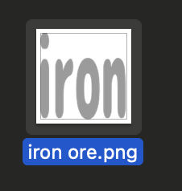
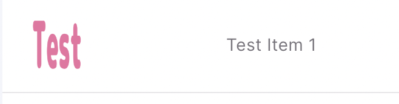

# Getting Started
このチュートリアルでは、既存のmodを取り込み、編集、テストプレイまでを行います。

## 既存modの取り込み
アルファ版時点でのmodはmoorestechBaseModだけとなっています。これは実行ファイルの配下にあります。

### 現在のmodファイルを確認する
Steamのmoorestechを右クリック > プロパティ > ローカルファイル > 参照をクリック

`server > mods` フォルダの中に `moorestechBaseMod.zip` があることが確認できます。

### ファイルを取り込む
zipファイルを解凍し、デスクトップなど好きな場所に移動させてください。

:::danger 解凍する場所について

Steam上のmodフォルダに編集中のmodを入れないでください。

アップデート時に消えるおそれがあります。

:::

[エディタ](https://editor.moores.tech/)を開き、上部のOpenProjectで先程解凍したフォルダを選択してください。
  
「サイトにファイルの編集を許可しますか？」というダイアログが出たら、「ファイルを編集」をクリックしてください。

  
  
このように下のフィールドが埋まったらロード成功です。  

## modの編集

### メタデータの編集
modを正常にロードできると、modのID、作成者、名前、バージョンなどのメタデータが表示され、編集できます。

試しに、名前を「moorestech Base Mod 2」に変更してみましょう。

### 編集結果の確認
エディタ上での編集は即座にmodに反映されます。

先ほど解凍したフォルダを開き、`modMeta.json`を開いてください。

nameの項目が変更されていることが確認できます。

:::danger id,authorの変更について

modやセーブファイルのロードに問題が生じるため、id,authorの変更はしないでください。

:::

## アイテムの追加、編集
左のサイドバーからItemを選択し、アイテム編集、追加画面に移動します。

### アイテムを編集する
**※現在名前は編集できません。**

最大スタック数、アイテム画像を編集できます。

アイテムの画像はアイコンをクリックすることで編集できます。

試しに、最大スタック数を50、画像を以下の画像に変更してください。

以下のようになったら成功です。

### アイテムが編集されていることを確認する

アイテムの情報は `modフォルダ > config > item.json` に保存されています。

4行目のmaxStacksが50になっていることがわかります。

:::danger nameの変更について

nameの変更はmodのロードやセーブファイルのロードに不具合が生じるため行わないでください。

:::

### 画像の変更の確認

アイテムの画像は `modフォルダ > assets > item > iron ore.png` に保存されています。

アイテムの画像が変更されていることがわかります。

### アイテムを追加する
一番下までスクロールし、+ボタンをクリックします。

アイテム作成モーダルが出るので、アイテム名と最大スタック数を設定します。

アイテム名を `Test Item 1` 最大スタック数を`50`に設定し、Submitをクリックしてください。

以下のように、アイテムが追加されています。

アイコンの部分をクリックし、画像を追加することができます。

以下の画像を選択してみましょう。

このような表示になっていれば成功です。

### 追加結果の確認

編集の時と同じく、Jsonと画像ファイルを確認してみましょう。

`modフォルダ > config > item.json`を開くと、ファイル末尾に `Test Item 1`が追加されていることがわかります。

また、アイテムの画像  `modフォルダ > assets > item > Test Item 1.png` が追加されていることがわかります。

## テストプレイ

modのテストプレイを行うには、zipが合った `server/mods` フォルダ内のzipファイルを削除し、展開したフォルダをコピーします。

そのままゲームを起動すると、変更されたmodが読み込まれ、新しいアイテムが追加されています。

:::danger セーブファイルについて

modが変更されるとセーブファイルが書き換えられます！

セーブファイルは Windows + R キーで出たウィンドウに `%appdata%`　と入力し、その中の `.moorestech\saves\save_1.json` となっています。

必要な場合はバックアップを取ってください。

:::

